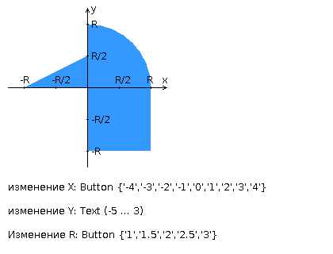
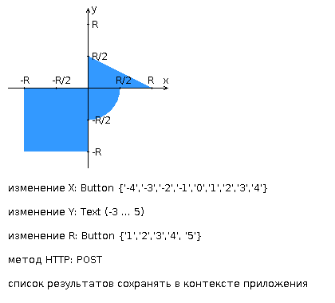

<h1>Web labs</h1>

<h3>lab1</h3>

Разработать PHP-скрипт, определяющий попадание точки на координатной плоскости в заданную область, и создать HTML-страницу, которая формирует данные для отправки их на обработку этому скрипту.

Параметр R и координаты точки должны передаваться скрипту посредством HTTP-запроса. Скрипт должен выполнять валидацию данных и возвращать HTML-страницу с таблицей, содержащей полученные параметры и результат вычислений - факт попадания или непопадания точки в область. Предыдущие результаты должны сохраняться между запросами и отображаться в таблице.

Кроме того, ответ должен содержать данные о текущем времени и времени работы скрипта.

<b>Разработанная HTML-страница должна удовлетворять следующим требованиям</b>:
<ul>
<li>Для расположения текстовых и графических элементов необходимо использовать табличную верстку.</li>
<li>Данные формы должны передаваться на обработку посредством POST-запроса.</li>
<li>Таблицы стилей должны располагаться в отдельных файлах.</li>
<li>При работе с CSS должно быть продемонстрировано использование селекторов элементов, селекторов идентификаторов, селекторов атрибутов, селекторов потомств а также такие свойства стилей CSS, как наследование и каскадирование.</li>
<li>HTML-страница должна иметь "шапку", содержащую ФИО студента, номер группы и новер варианта. При оформлении шапки необходимо явным образом задать шрифт (serif), его цвет и размер в каскадной таблице стилей.</li>
<li>Отступы элементов ввода должны задаваться в пикселях.</li>
<li>Страница должна содержать сценарий на языке JavaScript, осуществляющий валидацию значений, вводимых пользователем в поля формы. Любые некорректные значения (например, буквы в координатах точки или отрицательный радиус) должны блокироваться.</li>
</ul>

<h3>lab2</h3>

Разработать веб-приложение на базе сервлетов и JSP, определяющее попадание точки на координатной плоскости в заданную область.

Приложение должно быть реализовано в соответствии с шаблоном MVC и состоять из следующих элементов:
<ul>
  <li><b>ControllerServlet</b>, определяющий тип запроса, и, в зависимости от того, содержит ли запрос информацию о координатах точки и радиусе, делегирующий его обработку одному из перечисленных ниже компонентов. Все запросы внутри приложения должны передаваться этому сервлету (по методу GET или POST в зависимости от варианта задания), остальные сервлеты с веб-страниц напрямую вызываться не должны.</li>
  <li><b>AreaCheckServlet</b>, осуществляющий проверку попадания точки в область на координатной плоскости и формирующий HTML-страницу с результатами проверки. Должен обрабатывать все запросы, содержащие сведения о координатах точки и радиусе области.</li>
  <li><b>Страница JSP</b>, формирующая HTML-страницу с веб-формой. Должна обрабатывать все запросы, не содержащие сведений о координатах точки и радиусе области.</li>
</ul>
<b>Разработанная страница JSP должна содержать</b>:
<ul>
  <li>"Шапку", содержащую ФИО студента, номер группы и номер варианта.</li>
  <li>Форму, отправляющую данные на сервер.</li>
<li>Набор полей для задания координат точки и радиуса области в соответствии с вариантом задания.</li>
<li>Сценарий на языке JavaScript, осуществляющий валидацию значений, вводимых пользователем в поля формы.</li>
<li>Интерактивный элемент, содержащий изображение области на координатной плоскости (в соответствии с вариантом задания) и реализующий следующую функциональность:
  <ul>
<li>Если радиус области установлен, клик курсором мыши по изображению должен обрабатываться JavaScript-функцией, определяющей координаты точки, по которой кликнул пользователь и отправляющей полученные координаты на сервер для проверки факта попадания.</li>
<li>В противном случае, после клика по картинке должно выводиться сообщение о невозможности определения координат точки.</li>
<li>После проверки факта попадания точки в область изображение должно быть обновлено с учётом результатов этой проверки (т.е., на нём должна появиться новая точка).</li>
  </ul>
  </li>
<li>Таблицу с результатами предыдущих проверок. Список результатов должен браться из контекста приложения, HTTP-сессии или Bean-компонента в зависимости от варианта.</li>
</ul>
<b>Страница, возвращаемая AreaCheckServlet, должна содержать</b>:
<ul>
  <li>Таблицу, содержащую полученные параметры.</li>
  <li>Результат вычислений - факт попадания или непопадания точки в область.</li>
  <li>Ссылку на страницу с веб-формой для формирования нового запроса.</li>
  </ul>
Разработанное веб-приложение необходимо развернуть на сервере WildFly. Сервер должен быть запущен в standalone-конфигурации, порты должны быть настроены в соответствии с выданным portbase, доступ к http listener'у должен быть открыт для всех IP.
